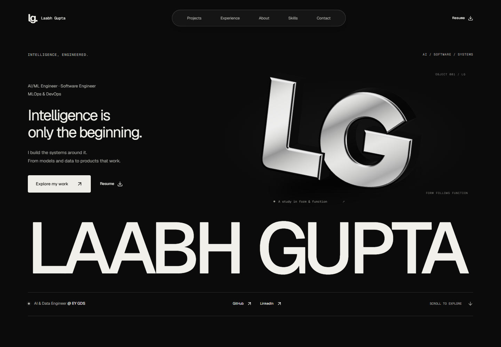

# Monochrome redesign — design and verification record

## Baseline, 3 October 2026

The new brief supersedes the earlier steel-blue design in REDESIGN.md. This is a new visual rebuild on the existing engineering foundation.

- Development branch: `codex/portfolio-redesign`, tracking `origin/codex/portfolio-redesign`.
- Starting feature commit: `167b014`; working tree clean; fetched remote matches local.
- Starting `main` and `origin/main`: `9f4db33`. Feature branch is three commits ahead.
- Remote: `https://github.com/Laabh-Gupta/Portfolio.git`.
- Build and lint pass. Browser baseline: 31 passed, seven deliberately skipped across desktop, tablet, mobile and small-mobile projects.
- Live Netlify currently serves the older main design. A feature-branch push does not update main.
- Delivery path: push and verify each committed milestone, then open a feature-to-main pull request. No history rewriting.

## Evidence inspected

Read the complete user-supplied `From 21st.dev.txt`, `Laabh_Gupta.pdf`, and `Raw Resume 2.docx`. The resume sources agree on EY progression, HAL, ArguLab, voice classification and education. Existing repository data remains the source for other projects and links. Metrics retain their scope: voice test-set accuracy, documented ArguLab v3.0.1 test counts and approximately 25% HAL decision-making improvement.

Inspected repository components, content data, 3D scene lifecycle, routing, prerendering, SEO, resume assets, Netlify configuration and existing Playwright checks. Preserve those useful contracts while replacing visual composition.

## Browser reference map

Research used actual live pages and embedded/standalone previews, not just search descriptions. Code tabs and visible usage examples were inspected. At the time of inspection, 21st.dev locks full component source and Copy prompt behind account sign-in/unlocks. Copy prompt opened the sign-in dialog. No account was created and no access restriction was bypassed. The supplied file provides the exact selected implementation/prompt material for glow, flow, magnetic cursor, adaptive navigation and raining letters. Additional locked components are visual references, not claimed source imports.

| Reference                                                                                                                         | Observed behavior                                                                                                                                                                                                                                                    | Design decision                                                                                                                                                                                      |
| --------------------------------------------------------------------------------------------------------------------------------- | -------------------------------------------------------------------------------------------------------------------------------------------------------------------------------------------------------------------------------------------------------------------- | ---------------------------------------------------------------------------------------------------------------------------------------------------------------------------------------------------- |
| [Current portfolio](https://laabh-portfolio.netlify.app/)                                                                         | Older blue system, compact hero and technical diagram.                                                                                                                                                                                                               | Preserve factual content and routes; replace visual hierarchy.                                                                                                                                       |
| [Aayush Duhan](https://aayush-duhan-portfolio.netlify.app/)                                                                       | Particle atmosphere, pointer-responsive extruded A, role animation, clear hero actions.                                                                                                                                                                              | Match ambition with an original LG sculpture; do not copy teal palette or boxed identity.                                                                                                            |
| [Spotlight Card — Hossain Jahed](https://21st.dev/@jahed/components/spotlight-card)                                               | Dark rectangular cards with rounded edges; moving light reveals neighboring edges. Surface falloff, bright masked rim and external bloom are separate layers. Verified by moving into the gap in standalone preview. Usage exports GlowCard, matching supplied file. | Retain all three luminance layers. Convert hue to neutral white; keep touch scrolling and keyboard focus.                                                                                            |
| [Flow Field Background — Hossain Jahed](https://21st.dev/@jahed/components/flow-field-background)                                 | Fine curved particle trails accumulate into flowing fibers; pointer repulsion changes the field. Supplied implementation uses trigonometric flow, velocity, friction, age and alpha trails.                                                                          | Use the actual flow algorithm in a subdued monochrome atmosphere. Bound rendering, pause offscreen/hidden, use a static composed fallback.                                                           |
| [Fluid Magnetic Cursor — Hossain Jahed](https://21st.dev/@jahed/components/magnetic-cursor)                                       | Circular follower morphs to a hovered target, expanding around its bounds; exclusion inverts the target while contrast remains legible. Demonstrated with Smart Contrast block.                                                                                      | Restrict to intentional magnetic controls; retain native text selection and fine-pointer/reduced-motion gates. Reuse Motion/ref-based animation instead of adding GSAP and Vecteur.                  |
| [3D Adaptive Navigation Bar — Om](https://21st.dev/@rhllom/components/3d-adaptive-navigation-bar)                                 | Compact Home pill expands to four links with a spring; delayed collapse; selected label returns after click. Usage exports PillBase, matching supplied file.                                                                                                         | Adapt expansion and active-label behavior into dark translucent navigation. Add keyboard activation and focus-safe expansion plus a proper mobile dialog. Do not copy the glossy white styling.      |
| [Portfolio Hero — vvisedev Crafts](https://21st.dev/@waleedkibhen/components/portfolio-hero)                                      | Large stacked name, per-letter blur entrance, central portrait overlay, ample black negative space.                                                                                                                                                                  | Use confident typographic scale and overlapping depth. Replace borrowed portrait/lime with original LG and monochrome; make roles and next action explicit.                                          |
| [Portfolio Hero with paper shaders — shadway / Jessi](https://21st.dev/@moazamtrade/components/portfolio-hero-with-paper-shaders) | Spare monospaced resume information and oversized magenta dithered shader on the right. Uses paper-design shaders.                                                                                                                                                   | Reference only: useful negative space, but pixel shader competes with the personal sculpture and adds another rendering system.                                                                      |
| [Project Showcase — Jatin Yadav](https://21st.dev/@jatin-yadav05/components/project-showcase)                                     | Fine-rule list, year metadata, link underline, rounded floating image that follows the pointer with lag. Hovering Flux produces a large lifted preview.                                                                                                              | Use an interactive editorial project index with visual previews and clear case-study/repository actions; ensure touch and keyboard expose the same content. Give ArguLab a larger dedicated feature. |
| [Text Scramble — Motion Primitives](https://21st.dev/@ibelick/components/text-scramble)                                           | Short monochrome text resolves from randomized characters. Visible examples support duration, custom characters and optional hover retrigger.                                                                                                                        | A finite introductory micro-label; name and role stay readable. Use supplied scramble approach with cleanup and reduced-motion support.                                                              |
| [Code Rain — Serafim](https://21st.dev/@serafimcloud/components/code-rain)                                                        | Green flickering ASCII video, unlike the supplied React RainingLetters implementation.                                                                                                                                                                               | Rejected. Exact public RainingLetters page was not found in catalog search. Supplied source was read in full; continuous 300-character rain is omitted for visual restraint.                         |

## Design system

### Color and material

Near-black canvas (#0b0b0b), charcoal surfaces (#141414, #1d1d1d), off-white text (#f1f0eb), warm-neutral secondary type (#aaa9a4). A contrasting paper section (#eae9e4) with near-black text gives career evidence a distinct chapter. No blue/cyan/neon interface accents. Borders use luminance, with stronger interactive edges and subtle static dividers. White selection and clearly visible focus rings.

### Typography and spacing

Existing self-hosted Geist Sans and Geist Mono. Large editorial name; restrained medium-weight headings, readable body copy, uppercase mono captions with modest tracking. Fluid type sizing, a shared 1280px content grid, responsive gutters and an 8px spacing rhythm. Major chapter spacing of roughly 112–144px desktop, 72–88px mobile. Radius is restrained: 6–12px on major surfaces, pills only for navigation/filter controls.

### Page composition

1. Hero: full-width name, original sculptural LG overlapping a carefully reserved visual area, explicit engineering roles, concise systems positioning, work/resume actions and current EY role.
2. Selected work: ArguLab as a substantial product feature with a precise interface/architecture visual and verified evidence; Voice Anti-Spoofing as the second major project; interactive index for the remaining five projects.
3. Experience: off-white editorial spread. EY current role and internship progression, two documented enterprise projects, then HAL and its scoped result.
4. About: a concise lifecycle statement with models → applications → APIs → data → testing → deployment.
5. Skills: relationship-driven evidence panels using actual projects and technologies; training explicitly distinguished where relevant.
6. Education/certifications: compact supporting evidence.
7. Contact: large natural call to action, real email and links, quiet monochrome flow atmosphere; minimal footer.

### Architecture and effects

Retain React/TypeScript/Vite, routing, content modules, Base UI semantics, Motion, Lenis, prerendering and tests. Build section-level composition with shared headings, links, buttons, spotlight surfaces and project visuals. No new animation framework.

The LG model remains behind the existing lazy scene boundary. Replace its geometry/material/lighting and fallback artwork. The model factory remains swappable; cap DPR; render on demand and stop at rest; dispose geometry, materials, textures, observers, listeners and WebGL context. Mobile and reduced-motion use a deliberate static sculpture, not a blank gap.

Motion: short, settling transitions; one finite intro; subtle pointer response. No constant bouncing, automatic carousel or endless letter rain. Focus and touch reveal the same essential information as hover. Fallbacks are complete compositions.

### Responsive and acceptance targets

Inspect 320, 390, 768, 1024 and 1440+ widths. Preserve legible roles and useful actions at every size. Recompose sculpture and project visuals on mobile; remove custom pointer effects; avoid horizontal overflow and hover-only information.

Run TypeScript, lint, build and browser checks at coherent milestones; compare screenshots and actual interactions to references; refine before delivery. Final checks cover routes, metadata, prerendered content, resume download, external links, touch, keyboard, reduced-motion changes, context failure/cleanup, console errors and accessibility.

## Implementation and final verification

### Delivered composition

The hero is rebuilt around an editorial full-width name, explicit roles, a concise systems statement, two primary actions, and a curved, beveled silver LG sculpture. Short desktop viewports receive a tighter composition; touch/mobile receive a complete matching SVG. The active-section navigation collapses into a compact pill, expands on hover or keyboard activation, and preserves the accessible mobile dialog.

ArguLab is now a large feature with an interactive practice / review / remember illustration, real product links, documented quality evidence, and the detailed case-study route. The second feature presents Voice Anti-Spoofing and its scoped test result. The project index combines fine rules, hover/focus selection, explicit repository actions, category filters, and original garment, signal, portal, transaction, and journal illustrations. On mobile the selected illustration moves inside its project row.

EY receives an off-white editorial chapter with current role, internship progression, and two enterprise workflow outlines. HAL remains a separate, accurately scoped experience. About is rewritten around engineering across the lifecycle. A clickable model → interface → API → data → quality → delivery map selects the corresponding evidence-backed skill panel. Education and certifications remain compact, followed by a large contact composition.

The favicon and social card now match the monochrome system. The Udemy short URL failed TLS verification during final checks; the official certificate page was opened and verified as Laabh Gupta, MLOps Zero to Hero, 14 September 2026, 12.5 hours. Both website references and the resume annotation now use the verified official URL. Resume text and two-page layout are unchanged.

### Reference adaptations actually implemented

- **Spotlight Card:** three independent layers—surface falloff, masked bright rim, and exterior bloom. Pointer coordinates remain local to each card while nearby edges can respond. White luminance replaces hue. Keyboard focus retains a static bright edge; touch and reduced motion omit pointer glow.
- **Flow Field:** the supplied sin/cos field, acceleration, velocity, friction, particle lifetimes, wrapping, alpha trails, and pointer repulsion. Particle count is bounded; initial motion lasts roughly four seconds, pointer activity can trigger a shorter burst, and offscreen/hidden/reduced-motion states stop drawing.
- **Fluid Magnetic Cursor:** target-size morph, interpolated movement, and exclusion contrast on opted-in actions. A small ref-based requestAnimationFrame loop settles; no GSAP or Vecteur added. Native text selection and ordinary pointer behavior remain elsewhere.
- **PillBase / adaptive navigation:** compact selected-label pill, expanding links, delayed pointer collapse, selected section tracking, keyboard activation, and mobile dialog. Adapted with existing React/CSS/Base UI rather than importing the demo shell.
- **Portfolio Hero:** typographic scale and reserved negative space inform an original composition with LG artwork and engineering content.
- **Project Showcase:** fine-rule selection and changing visual preview, recomposed as a stable side-by-side index with keyboard and touch parity rather than a pointer-only floating image.
- **Text Scramble:** the existing finite micro-label implementation is retained; the name and role remain stable. Continuous letter rain and the second shader system are deliberately omitted.

No new runtime or development dependencies were installed.

### 3D implementation

`identity/model.ts` creates custom curved L/G shapes with beveled extrusion, metallic materials, and a procedural 512px brushed finish. `identity/scene.ts` uses an orthographic camera, four procedural studio softboxes, a generated environment, and restrained pointer rotation. The initial flatter material was revised after comparing actual rendered screenshots to the static fallback.

The model factory remains replaceable within a centered 4.5 × 3 unit envelope. Loading is lazy, gated by visibility, width, fine pointer, and motion preference. DPR is capped at 1.5. The scene renders on demand and settles; context failure leaves the fallback intact. Geometry, shared materials, textures, environment, listeners, observers, and the WebGL context are disposed. No external model, portrait, HDR, or texture request is required.

### File inventory

Created in this rebuild:

- `src/sections.css`, `src/projects.css`
- `src/components/ProjectGallery.tsx`, `ProjectArtwork.tsx`, `MagneticCursor.tsx`
- `tests/redesign.spec.ts`
- `docs/MONOCHROME_REDESIGN.md` and `docs/screenshots/`

Rebuilt or substantially updated:

- `src/styles.css`, `src/responsive.css`, `src/case-study.css`
- `Hero.tsx`, `Identity.tsx`, `Navbar.tsx`, `Projects.tsx`, `ArgulabPreview.tsx`
- `identity/model.ts`, `identity/scene.ts`, `GlowCard.tsx`, `FlowField.tsx`
- `About.tsx`, `Experience.tsx`, `TechStack.tsx`, `Contact.tsx`, and `App.tsx`
- `PageBehavior.tsx` waits for self-hosted fonts before resolving anchor positions.
- `public/mark.svg`, `public/social-card.png`, and `scripts/build_social.py`
- `src/data/portfolio.ts`, `scripts/build_resume.py`, and both public resume PDFs: certificate destination only.
- Browser tests and README; the old redesign document is marked historical.

Preserved: React/TypeScript/Vite, router and legacy redirects, detailed case-study facts, SEO/canonical/schema, prerendered route HTML, Netlify/Vercel configuration, package/lock files, contact and project destinations, self-hosted fonts, resume filenames/download behavior, and original Git history.

### Validation and visual iteration

- TypeScript, ESLint, production client/server build, prerendering, and Prettier pass.
- Full production-preview Playwright suite: **37 passed, 13 intentional device-specific skips**, zero failures. This includes desktop/tablet/mobile/small-mobile home and case-study axe checks, console errors, overflow, filters, keyboard tabs, menu focus/Escape/anchors, resume and metadata, deep links, reduced motion, optional rendering, WebGL failure/context loss, real idle GPU draw counts, and the new gallery/navigation/cursor workflows.
- Rendered views inspected at 320, 390, 768, 1024, 1280×720, and 1440px. Revisions addressed mobile spectrogram min-content overflow, resulting anchor displacement, short-screen hero fit, flat metal, preview prominence, and active-panel transition overlap.
- Source URLs for all seven project repositories, ArguLab history/live app, and LinkedIn returned HTTP 200. LeetCode returned HTTP 403 to scripted HEAD but its actual profile loaded in the browser. Udemy's official certificate page loaded and matched the supplied record; the expired short link was replaced without bypassing certificate validation.
- Regenerated resume: two pages; extracted text identical before/after; official certificate annotation present; current and legacy PDF filenames contain matching bytes.
- After the final material and certificate-link changes, all 10 affected checks passed again: 3D loading/idle/failure/context loss, touch exclusion, 1024px accessibility/flow, spotlight, and resume/route/metadata checks at all four sizes.

### Performance and practical limits

Latest build: main client 485.97 kB raw / 157.09 kB gzip; optional 3D renderer 565.36 / 142.74; lazy case study 17.44 / 5.34; Lenis 18.61 / 5.40; CSS 69.15 / 14.82. Fonts are self-hosted and browser-selected by character range.

The optional Three.js chunk triggers Vite's 500 kB raw-size warning. It is isolated and skipped on touch/reduced-motion devices; no threshold was raised to conceal it. Device coverage uses Chromium/Edge emulation plus the in-app browser, not physical iOS hardware. No claim of a production deployment is made by a feature-branch push.

21st.dev's locked full source / Copy prompt could not be retrieved without signing in; implementation uses the supplied complete reference file and observed public previews. The exact RainingLetters public page was not found. These research limits are separate from the implemented site's functional checks.

### Delivery checkpoints

- `fc15a0d`: verified baseline and reference/design record, pushed and remote hash checked.
- `d367f87`: monochrome foundation, hero, 3D identity, and responsive navigation, pushed and remote hash checked.
- `0994d50`: project stories, gallery, lifecycle map, effects, sharing assets, and interaction tests, pushed and remote hash checked.
- Final verification/material/certificate checkpoint: see the branch tip and pull request. Every intentional checkpoint is pushed normally; main is not rewritten.

### Finished views

[Mobile hero](./screenshots/hero-mobile.png) · [Full desktop composition](./screenshots/portfolio-desktop.png)
